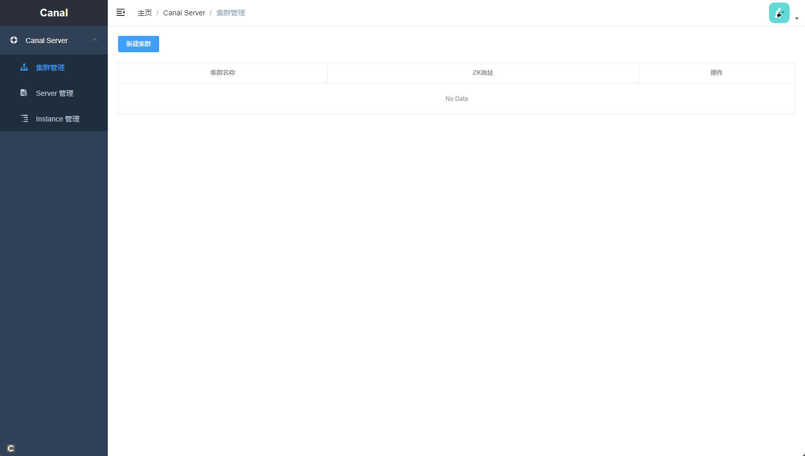
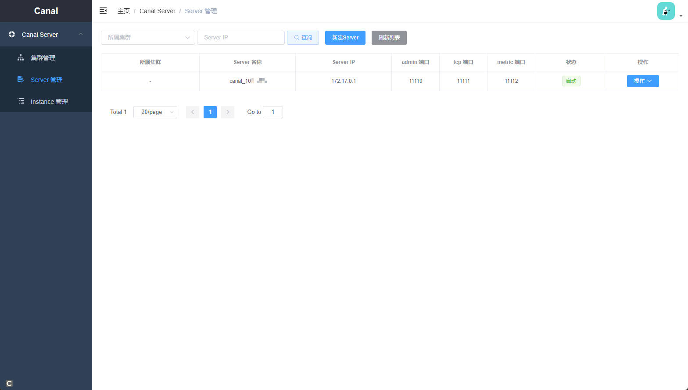
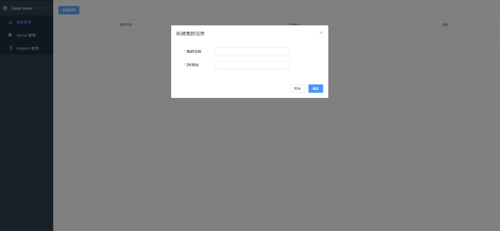
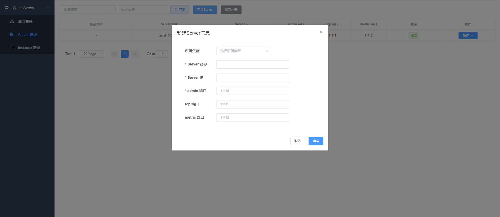
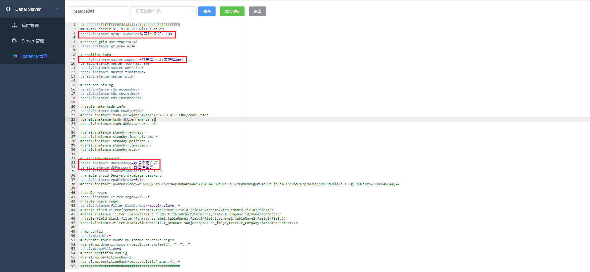

### 一、安装canal组件
1. 下载 canal.deployer 包到 /opt/software 
```shell
mkdir /opt/software
cd /opt/software
wget https://github.com/alibaba/canal/releases/download/canal-1.1.5/canal.deployer-1.1.5.tar.gz
并解压到
mkdir /opt/module
mkdir /opt/module/canal
tar -zxvf canal.deployer-1.1.5.tar.gz -C /opt/module/
```

2. 下载 canal.adapter 包到 /opt/software
```shell
wget https://github.com/alibaba/canal/releases/download/canal-1.1.5/canal.adapter-1.1.5.tar.gz
并解压
mkdir /opt/module/canal_adapter
tar -zxvf canal.adapter-1.1.5.tar.gz -C /opt/module/canal_adapter/
```

3. 下载 canal.admin 包到 /opt/software
```shell
wget https://github.com/alibaba/canal/releases/download/canal-1.1.5/canal.admin-1.1.5.tar.gz
并解压
mkdir /opt/module/canal_admin
tar -zxvf canal.admin-1.1.5.tar.gz -C /opt/module/canal_admin/
```

+ 注：没有JDK的话要提前安装JDK并配置环境变量（在此就不写JDK的安装了）。

### 二、配置相关组件

1. Canal admin 配置
+ 初始化元数据库
```shell
cd /opt/module/canal_admin/conf
找到canal_manager.sql 这是 canal_admin 的数据库初始化 sql，将此sql在你的mysql数据库上执行。
```

+ 修改 application.yml
```shell
cd /opt/module/canal_admin/conf
vim application.yml
```
修改为以下内容(根据自己的配置对应更改)：
```shell
server:
  port: 8089 # canal_admin web 服务器的端口
spring:
  jackson:
    date-format: yyyy-MM-dd HH:mm:ss
    time-zone: GMT+8

spring.datasource: # canal_admin 元数据库配置（即之前初始化 canal_manager.sql 的数据库）
  address: db_host:db_port
  database: db_name
  username: db_user
  password: db_password
  driver-class-name: com.mysql.jdbc.Driver
  url: jdbc:mysql://${spring.datasource.address}/${spring.datasource.database}?useUnicode=true&characterEncoding=UTF-8&useSSL=false
  hikari:
    maximum-pool-size: 30
    minimum-idle: 1

canal:
  adminUser: admin
  adminPasswd: admin
```
+ 启动或停止 canal_admin 服务
```shell
启动
cd /opt/module/canal_admin/bin
./startup.sh

停止
cd /opt/module/canal_admin/bin
./stop.sh
```

+ 启动 canal_admin 之后，通过浏览器访问 http://127.0.0.1:8089 即可进入canal_admin的 web 后台，这时就可以动态配置 canal 的配置项了。
```shell
默认登录信息：
username: admin
password: 123456
```


2. Canal配置

+ 修改canal.properties
```shell
cd /opt/module/canal/conf
vim canal.properties
```

+ 修改 instance.properties 为以下内容:
```shell
# register ip
canal.register.ip =

# canal admin config
canal.admin.manager = canal_admin_host:canal_admin_port # 更换为实际的 canal_admin 的 host 和 port
canal.admin.port = 11110 
canal.admin.user = admin
canal.admin.passwd = 4ACFE3202A5FF5CF467898FC58AAB1D615029441
# admin auto register
canal.admin.register.auto = true # 自动注册到 canal_admin
canal.admin.register.cluster =
canal.admin.register.name = canal_001 # 注册到 canal_admin 上的名字
```

+ 启动或停止 canal 服务
```shell
启动
cd /opt/module/canal/bin
./startup.sh 

停止
cd /opt/module/canal/bin
./stop.sh
```

+ 启动 canal 服务后即可自动注册到 canal_admin，在 canal_admin 后台管理就可以看到已注册的 canal server 节点。


### 三、使用 canal_admin 管理 canal 的配置项

1. 新建集群


2. 新建 canal server 节点


3. 新建 instance


新建instance：配置slaveId, 数据源
可根据自己的需要修改binlog过滤器，配置正则表达式：
```shell
常见例子：
1.  所有表：.*   or  .*\\..*
2.  database schema 下所有表： database\\..*
3.  database 下的以 table 打头的表：database\\.table.*
4.  database schema 下的一张表：database\\.test1
5.  多个规则组合使用：database\\..*,mysql.test1,mysql.test2 (逗号分隔)
6.  分库分表通用 database.*\\.table.*
```
到此 canal 和 canal_admin 就已经安装完了，后面就可以可以写程序连接相应的 canal 节点监听相应的 instance 就可以解析数据了。

+ 补充  
```shell
排错时可以查看日志
canal 日志目录默认在
canal/logs/canal/
instance 日志在 canal/logs/instance名称

canal_admin 日志目录默认在
canal_admin/logs/
```
```shell
instance 默认目录在
canal/conf/instance名称
```

### 如何指定同步开始的位置？
1. 停止数据同步订阅监听程序。
2. 从canal_admin web 后台停止 instance。
3. 菜单 "操作"->"修改"，找到下面的位置：
```shell
canal.instance.master.journal.name=           # binlog日志文件名称
canal.instance.master.position=               
canal.instance.master.timestamp=1658122463000 # 13位的时间戳
```
可自定义修改journal.name 或 timestamp 其中一项点击"修改"即可。
3. 删除 canal/conf/instance_name 目录下的 meta.dat。
4. 从canal_admin web后台启动 instance。
5. 启动数据同步订阅监听程序。

### 如何指定同步开始的位置？
1. 停止数据同步订阅监听程序。
2. 从canal_admin web 后台停止 instance。
3. 菜单 "操作"->"修改"，找到下面的位置：
```shell
canal.instance.master.journal.name=           # binlog日志文件名称
canal.instance.master.position=               
canal.instance.master.timestamp=1658122463000 # 13位的时间戳
```
可自定义修改journal.name 或 timestamp 其中一项点击"修改"即可。
3. 删除 canal/conf/instance_name 目录下的 meta.dat。
4. 从canal_admin web后台启动 instance。
5. 启动数据同步订阅监听程序。